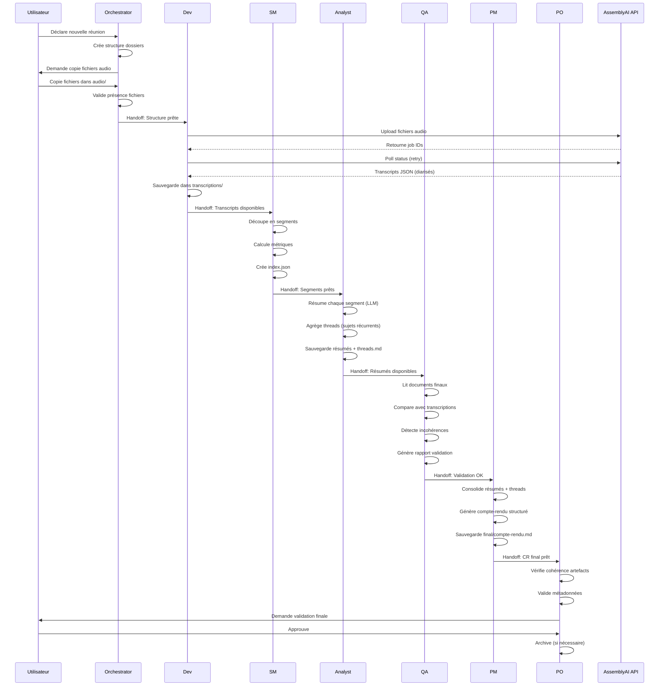

# Architecture - Meeting Transcription & Compte-Rendu

**Version :** 1.0  
**Date :** 2025-01-27  
**Epic :** [Meeting Transcription & Compte-Rendu](../epics/meeting-transcription.md)

---

## 1. Vue d'Ensemble

Le système de transcription et analyse de réunions est un **workflow BMAD multi-agents** qui transforme des fichiers audio multiples en compte-rendu structuré et validé.

### Principe Architectural

- **Workflow séquentiel** : Chaque agent exécute ses tasks dans l'ordre défini
- **Handoffs par fichiers** : Les agents communiquent via fichiers dans `meetings/<id>/`
- **Pas de contexte partagé** : Chaque agent lit les fichiers produits par les précédents
- **Validation continue** : Chaque étape produit des artefacts validables

---

## 2. Diagramme de Séquence



---

## 3. Architecture des Données

### Structure de Fichiers

```
meetings/
└── <meeting-id>/                    # Format: YYYY-MM-DD-nom-reunion
    ├── audio/                       # Input: Fichiers audio originaux
    │   ├── speaker1.mp3
    │   ├── speaker2.mp3
    │   └── ...
    │
    ├── transcriptions/               # Output Orchestrator/Dev
    │   ├── speaker1.json            # JSON brut AssemblyAI
    │   ├── speaker2.json
    │   └── full-transcript.json     # Transcription complète consolidée
    │
    ├── working/                      # Documents de travail intermédiaires
    │   ├── segments/                 # Output SM
    │   │   ├── segment-001.md       # Format: timestamp, speaker, texte
    │   │   ├── segment-002.md
    │   │   └── ...
    │   │
    │   ├── summaries/                # Output Analyst
    │   │   ├── summary-001.md        # Résumé structuré par segment
    │   │   ├── summary-002.md
    │   │   └── ...
    │   │
    │   ├── threads.md                # Output Analyst: Sujets récurrents agrégés
    │   ├── index.json                # Output SM: Index segments avec métadonnées
    │   └── validation-report.md      # Output QA: Rapport de validation
    │
    └── final/                        # Output final PM
        └── compte-rendu.md          # Compte-rendu structuré final
```

### Format des Fichiers

#### `transcriptions/<file>.json` (AssemblyAI)
```json
{
  "id": "transcript_id",
  "status": "completed",
  "text": "Texte complet de la transcription...",
  "utterances": [
    {
      "start": 1000,
      "end": 5000,
      "speaker": "A",
      "text": "Première intervention..."
    }
  ],
  "speakers": {
    "A": "Speaker 1",
    "B": "Speaker 2"
  }
}
```

#### `working/segments/segment-001.md`
```markdown
# Segment 001

**Timestamp :** 00:01:40 - 00:05:20  
**Speaker :** A (Speaker 1)  
**Durée :** 3m40s

## Texte

[Texte du segment...]
```

#### `working/summaries/summary-001.md`
```markdown
# Résumé Segment 001

**Tags :** #sujet1 #decision #action

## Points discutés
- Point 1
- Point 2

## Décisions
- Décision 1

## Actions (RACI)
- Action 1 - Responsable: Nom

## Risques
- Risque 1

## Questions ouvertes
- Question 1

## Tableau chronologique
| Timestamp | Speaker | Résumé |
|-----------|---------|--------|
| 00:01:40 | A | ... |
```

#### `working/threads.md`
```markdown
# Sujets Récurrents (Threads)

## Thread #sujet1
- Apparu dans segments: 001, 005, 012
- Évolution: [description]
- Décisions finales: [liste]

## Thread #sujet2
...
```

#### `final/compte-rendu.md`
```markdown
# Compte-rendu - [Nom Réunion]

**Date :** 2025-01-27  
**Participants :** [Liste détectée]  
**Durée :** [Calculée]

## Ordre du jour
1. Sujet 1
2. Sujet 2

## Sujet 1 : [Titre]
### Décisions prises
- [Décision]

### Actions (RACI)
- [Action] - Responsable: [Nom]

### Questions ouvertes
- [Question]

### Chantiers ouverts
- [Chantier]

## Sujet 2 : [Titre]
...
```

---

## 4. Flux des Agents

### Orchestrator (Setup)
**Rôle :** Initialisation et validation des prérequis

**Tasks :**
1. `create_meeting_folder` : Crée structure `meetings/<id>/`
2. `prompt_copy_audio` : Invite utilisateur à copier fichiers
3. `validate_audio_presence` : Vérifie présence fichiers audio

**Input :** Aucun (démarrage workflow)  
**Output :** Structure dossiers + fichiers audio dans `audio/`

---

### Dev (Transcription)
**Rôle :** Intégration API AssemblyAI

**Tasks :**
1. `transcribe_aai` : Lance script `aai_transcribe.py`

**Input :** Fichiers audio dans `audio/`  
**Output :** Fichiers JSON dans `transcriptions/`

**Script :** `scripts/aai_transcribe.py`
- Upload fichiers vers AssemblyAI
- Poll status avec retries
- Récupère JSON transcripts
- Sauvegarde dans `transcriptions/`

---

### SM (Préparation Lots)
**Rôle :** Découpage et indexation

**Tasks :**
1. `prepare_segments` : Découpe transcriptions en segments
2. `compute_metrics` : Calcule métriques (tokens, taille, overlap)

**Input :** Fichiers JSON dans `transcriptions/`  
**Output :** Segments dans `working/segments/` + `working/index.json`

**Logique :**
- Découpage par fenêtre temporelle (ex: 5 min)
- Overlap entre segments (ex: 30s)
- Index avec métadonnées (timestamp, speaker, tokens)

---

### Analyst (Analyse)
**Rôle :** Résumé et agrégation intelligente

**Tasks :**
1. `summarize_segments` : Résume chaque segment (prompt LLM)
2. `build_threads` : Agrège sujets récurrents

**Input :** Segments dans `working/segments/`  
**Output :** Résumés dans `working/summaries/` + `working/threads.md`

**Prompts :**
- Prompt Analyst standard (voir `docs/prompts/analyst-summary.md`)
- Extraction tags, décisions, actions RACI, risques, questions

---

### QA (Validation Inverse)
**Rôle :** Vérification qualité et cohérence

**Tasks :**
1. `inverse_validation` : Compare docs ↔ transcriptions

**Input :** Résumés + threads + transcriptions  
**Output :** `working/validation-report.md`

**Logique :**
- Lit documents finaux (résumés, threads)
- Compare avec transcriptions brutes
- Détecte incohérences, oublis, divergences
- Génère rapport avec actions recommandées

---

### PM (Synthèse)
**Rôle :** Consolidation et génération CR final

**Tasks :**
1. `generate_meeting_report` : Produit compte-rendu structuré

**Input :** Résumés + threads + validation report  
**Output :** `final/compte-rendu.md`

**Prompts :**
- Prompt PM standard (voir `docs/prompts/pm-synthesis.md`)
- Consolidation, élimination redites, ordre chronologique

---

### PO (Clôture)
**Rôle :** Validation finale et archivage

**Tasks :**
1. `verify_artifacts_consistency` : Vérifie cohérence artefacts
2. `approve_and_archive` : Clôture et archive

**Input :** Tous les artefacts produits  
**Output :** Validation finale + archivage (si nécessaire)

---

## 5. Gestion des Erreurs

### Niveaux de Retry

1. **Erreurs temporaires (429, 503, timeout)**
   - Retry automatique avec backoff exponentiel
   - Max 3 tentatives
   - Log dans `logs/run-YYYYMMDD.log`

2. **Erreurs définitives (400, 401, 404)**
   - Notification utilisateur immédiate
   - Log détaillé avec message d'erreur
   - Arrêt du workflow avec état sauvegardé

3. **Erreurs de validation**
   - Rapport d'erreurs dans `working/validation-report.md`
   - Workflow continue mais marque les incohérences
   - PO décide de la clôture ou correction

### Sauvegarde d'État

Chaque étape sauvegarde son état dans :
- `working/index.json` : État global du traitement
- `working/report.md` : Rapport intermédiaire
- `logs/run-YYYYMMDD.log` : Logs d'exécution

Permet de reprendre le workflow à n'importe quelle étape.

---

## 6. Intégrations

### AssemblyAI API

**Endpoints utilisés :**
- `POST /upload` : Upload fichiers audio
- `POST /transcript` : Créer job transcription
- `GET /transcript/{id}` : Récupérer transcription

**Paramètres :**
- `language_code: fr` (Français)
- `speaker_labels: true` (Diarisation)
- `iab_categories: true` (Topics IAB)

**Authentification :**
- Clé API dans `.env` : `ASSEMBLYAI_API_KEY`

---

## 7. Performance & Scalabilité

### Métriques Cibles

- **Temps transcription** : ~5-10 min par fichier audio de 1h
- **Temps traitement total** : < 30 min pour réunion de 1h (4 fichiers)
- **Taille segments** : 5-10 min de transcription par segment
- **Overlap segments** : 30s pour préserver contexte

### Optimisations

- Traitement parallèle des fichiers audio (si API le permet)
- Cache des résumés pour éviter re-traitement
- Index JSON pour accès rapide aux segments

---

## 8. Sécurité & Confidentialité

### Données Sensibles

- **Fichiers audio** : Contenus de réunions (potentiellement confidentiels)
- **Transcripts** : Textes complets des conversations
- **Comptes-rendus** : Synthèses avec décisions et actions

### Mesures

- **Gitignore** : Dossier `meetings/` exclu du versioning
- **Accès local** : Fichiers stockés uniquement en local (IDE)
- **Pas de cloud** : Aucun upload automatique vers services externes (sauf AssemblyAI pour transcription)

---

**Fin de l'Architecture**


