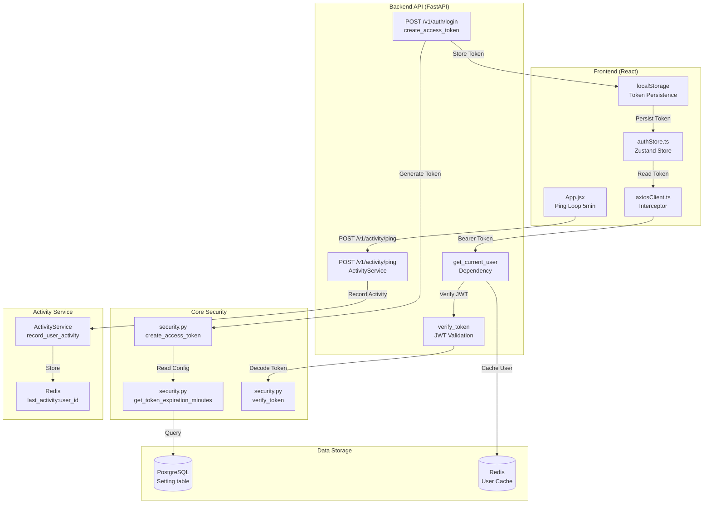
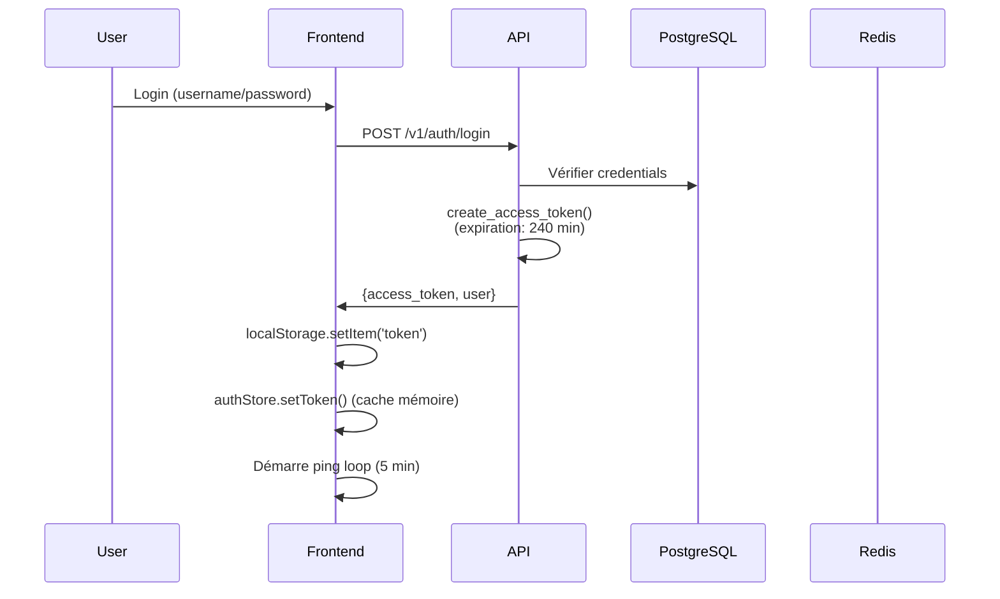
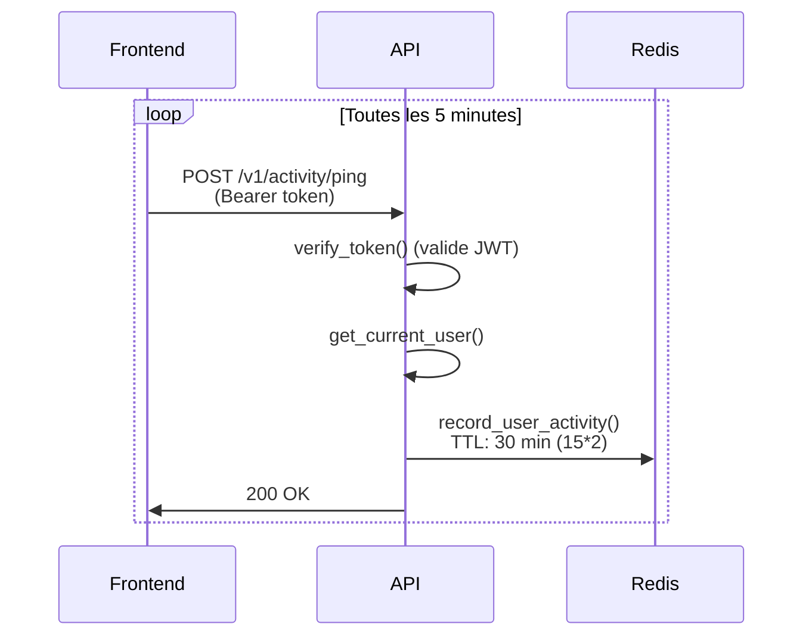
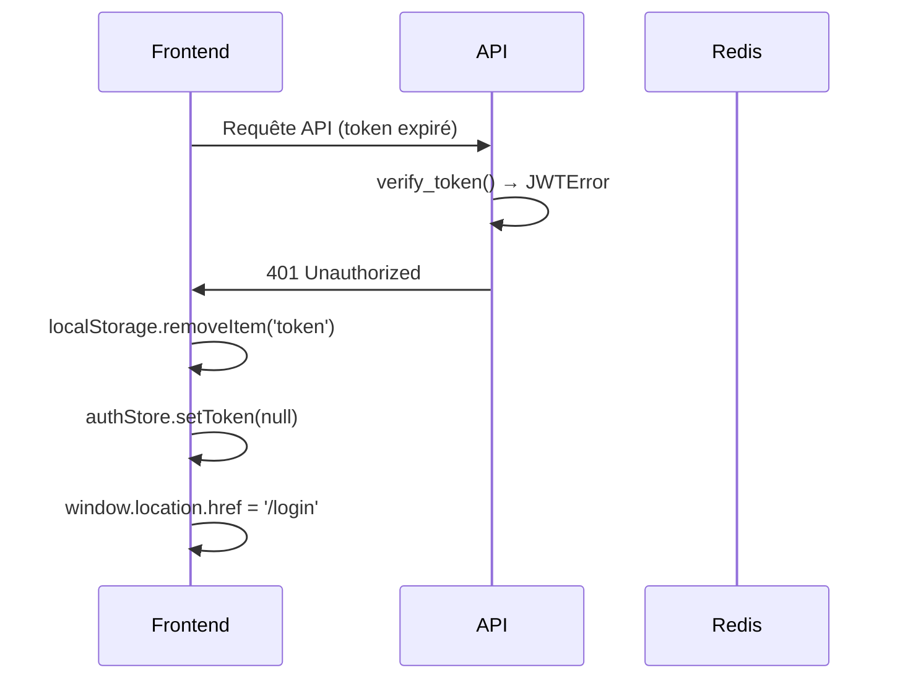

# Audit Technique - Session Glissante (B42-P1)

**Date:** 2025-11-26  
**Auteur:** James (Dev Agent)  
**Story:** B42-P1 - Audit & design de la session glissante

---

## 1. Diagramme de Cartographie Complète

---

## 2. Cartographie des Composants

### Tableau: Composant / Rôle / Limites

| Composant | Localisation | Rôle | Limites & Contraintes |
|-----------|--------------|------|----------------------|
| **JWT Token Creation** | `api/src/recyclic_api/core/security.py` `create_access_token()` | Crée un token JWT avec expiration dynamique | - Durée d'expiration lue depuis DB (`get_token_expiration_minutes()`) - Valeur par défaut: 480 min (8h) si non configurée - Plage valide: 1-10080 min (1 min à 7 jours) - Algorithme: HS256 - Payload contient: `sub` (user_id), `exp` |
| **Token Expiration Config** | `api/src/recyclic_api/core/security.py` `get_token_expiration_minutes()` | Récupère la durée d'expiration depuis la table `Setting` | - Clé DB: `token_expiration_minutes` - Valeur actuelle (selon story): 240 min (4h) - Cache: Aucun (lecture DB à chaque création de token) - Validation: 1 ≤ value ≤ 10080 |
| **Token Verification** | `api/src/recyclic_api/core/security.py` `verify_token()` | Vérifie et décode un token JWT | - Lève `HTTPException 401` si token invalide/expiré - Pas de vérification de révocation - Pas de blacklist de tokens |
| **User Authentication** | `api/src/recyclic_api/core/auth.py` `get_current_user()` | Dépendance FastAPI pour authentifier l'utilisateur | - Utilise `verify_token()` pour valider le JWT - Cache Redis (TTL: 300s) pour les requêtes GET/HEAD/OPTIONS - Vérifie `is_active` en DB si cache miss - Retourne `User` ou `CachedUser` |
| **Activity Service** | `api/src/recyclic_api/services/activity_service.py` `ActivityService` | Gère l'activité utilisateur en temps réel | - Stockage Redis: `last_activity:{user_id}` - Seuil d'inactivité: `activity_threshold_minutes` (défaut: 15 min) - TTL Redis: `threshold_minutes * 60 * 2` (double du seuil) - Cache en mémoire (classe) pour le seuil (TTL: 60s) |
| **Activity Ping Endpoint** | `api/src/recyclic_api/api/api_v1/endpoints/activity.py` `POST /v1/activity/ping` | Endpoint appelé périodiquement par le frontend | - Authentification requise (`get_current_user`) - Enregistre métadonnées (IP, user-agent, endpoint) - Fréquence frontend: toutes les 5 min (300s) - Arrêt si onglet caché (`document.hidden`) |
| **Frontend Auth Store** | `frontend/src/stores/authStore.ts` `useAuthStore` | Store Zustand pour l'état d'authentification | - Stockage token: `localStorage` (persistence) + mémoire (cache) - Pas de refresh token actuellement - Logout: supprime token + redirige `/login` - `initializeAuth()`: lit token au démarrage |
| **Axios Interceptor** | `frontend/src/api/axiosClient.ts` | Intercepte les requêtes/réponses HTTP | - Ajoute `Authorization: Bearer {token}` à chaque requête - Token lu depuis cache mémoire (Zustand) - Sur 401: supprime token + redirige `/login` - Ne déconnecte PAS sur 403 (permissions) |
| **App Ping Loop** | `frontend/src/App.jsx` `useEffect` (ligne 97-147) | Boucle de ping périodique | - Intervalle: 5 min (300000ms) - Condition: `isAuthenticated && !document.hidden` - Arrêt automatique si onglet caché - Démarrage au montage si authentifié |

---

## 3. Flux Actuel de Session

### 2.1 Connexion Initiale

### 2.2 Utilisation Normale (Session Active)

### 2.3 Expiration de Token

---

## 4. Points de Couplage Identifiés

### 3.1 Couplage Token ↔ ActivityService

- **Problème:** Le token JWT et l'ActivityService sont indépendants
  - Le token expire après 240 min (fixe, basé sur `token_expiration_minutes`)
  - ActivityService track l'activité avec seuil de 15 min (configurable)
  - Aucune synchronisation entre les deux

- **Impact:** Un utilisateur actif peut être déconnecté après 4h même s'il ping toutes les 5 min

### 3.2 Stockage Token Frontend

- **Localisation:** `localStorage` (persistence) + mémoire Zustand (cache)
- **Risques:**
  - XSS: token accessible via JavaScript malveillant
  - Pas de protection CSRF si token dans localStorage
  - Pas de refresh token (nécessite re-login à expiration)

### 3.3 Absence de Révocation

- **Problème:** Un token JWT valide reste valide jusqu'à expiration
  - Pas de blacklist
  - Pas de vérification de révocation en DB
  - Logout ne révoque pas le token (juste suppression côté client)

---

## 5. Contraintes Techniques

### 4.1 Backend

- **JWT stateless:** Pas de session serveur, token auto-contenu
- **Redis disponible:** Utilisé pour ActivityService et cache utilisateur
- **PostgreSQL:** Table `Setting` pour configuration dynamique
- **Pas de table `user_sessions`:** Pas de tracking de sessions actives

### 4.2 Frontend

- **PWA Offline-First:** Doit fonctionner hors ligne (IndexedDB)
- **Pas de Service Worker pour auth:** Pas de refresh automatique en arrière-plan
- **localStorage:** Utilisé pour persistance (risque XSS)

---

## 6. Configuration Actuelle

| Paramètre | Valeur Actuelle | Source | Modifiable |
|-----------|----------------|--------|------------|
| `token_expiration_minutes` | 240 min (4h) | DB (`Setting` table) | Oui (super-admin) |
| `activity_threshold_minutes` | 15 min | DB (`Setting` table) | Oui (admin) |
| Ping interval frontend | 5 min (300s) | Code (`App.jsx`) | Non (hardcodé) |
| User cache TTL | 300s (5 min) | Code (`auth.py`) | Non (hardcodé) |

---

## 7. Tests Existants

- **`api/tests/test_session_settings.py`:** Tests des endpoints GET/PUT `/api/v1/admin/settings/session`
  - Validation des valeurs (1-10080 min)
  - Vérification des rôles (super-admin requis)
  - Valeur par défaut (480 min)

- **Tests E2E Auth:** À vérifier dans `frontend/src/test/e2e/` (Playwright)

---

## 8. Gaps Identifiés

1. **Pas de refresh token:** Nécessite re-login à expiration
2. **Pas de sliding expiration:** Token expire même si utilisateur actif
3. **Pas de synchronisation:** Token expiration ≠ ActivityService threshold
4. **Pas de révocation:** Token reste valide même après logout
5. **Risque XSS:** Token dans localStorage accessible via JavaScript
6. **Pas de gestion offline:** Token expire même si utilisateur revient après déconnexion réseau

---

## 9. Prochaines Étapes

Voir le document RFC: `docs/architecture/sliding-session-rfc.md` (à créer dans la tâche suivante)

