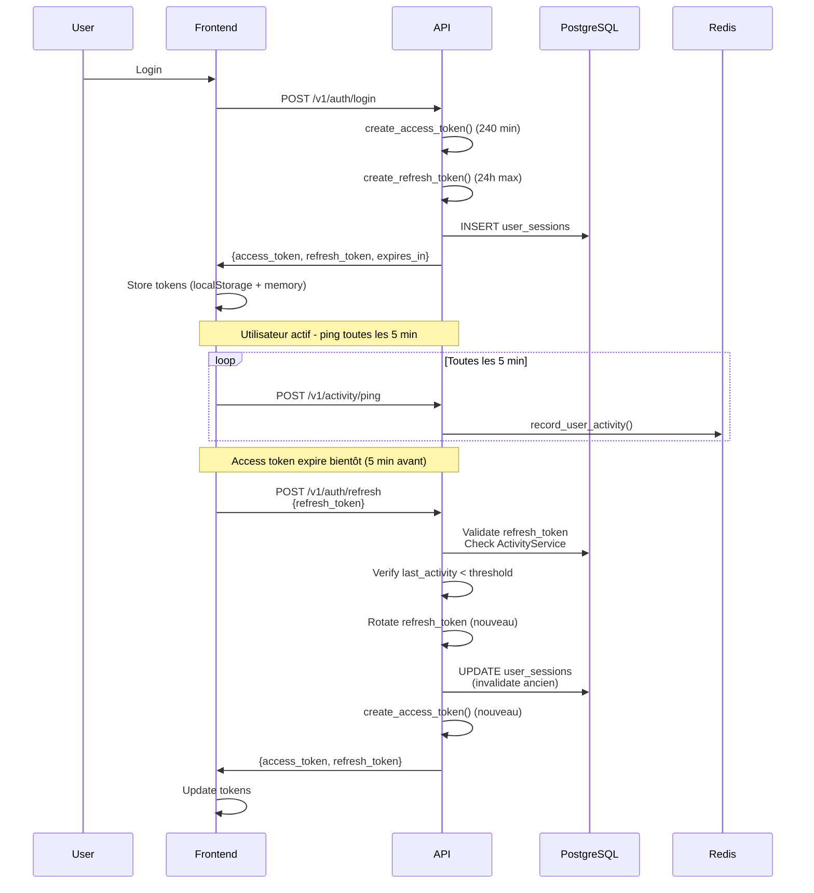
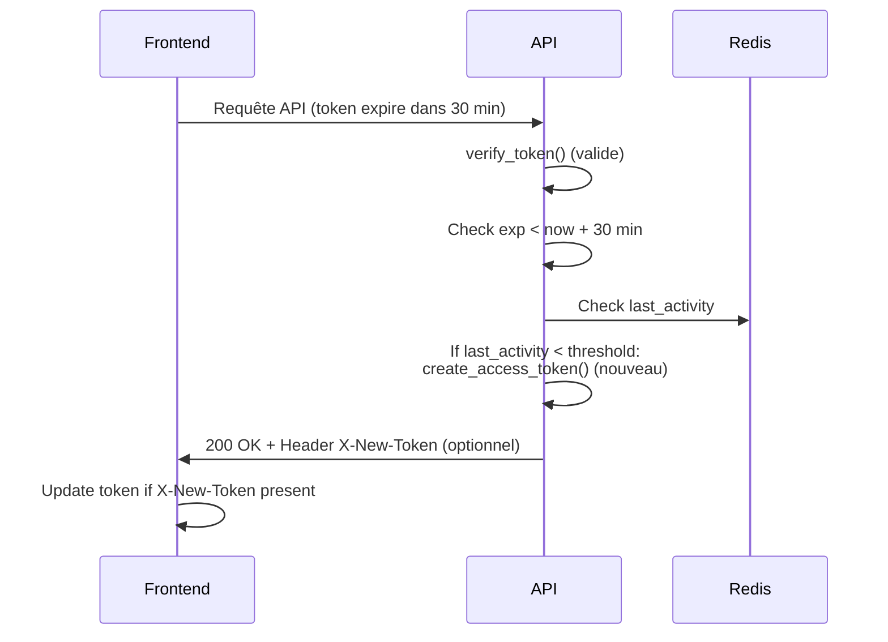
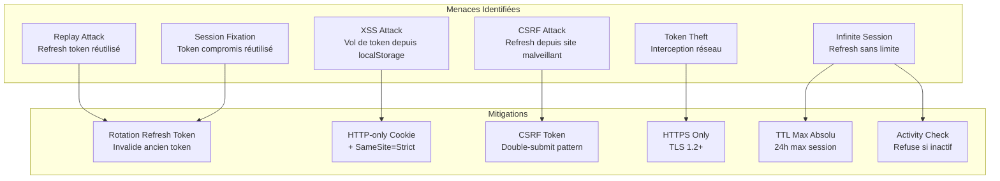

# RFC: Sliding Session Design - Session Glissante

**Date:** 2025-11-26  
**Auteur:** James (Dev Agent)  
**Story:** B42-P1 - Audit & design de la session glissante  
**Version:** 1.0

---

## 1. Objectif

Implémenter une session glissante qui maintient les utilisateurs actifs connectés sans étendre indéfiniment la durée de validité d'un token compromis, tout en respectant les contraintes de sécurité et d'offline-first.

---

## 2. Options Évaluées

### Option A: Refresh Token avec Rotation (Recommandée)

#### Description
- **Access Token (JWT):** Durée courte (240 min configurable)
- **Refresh Token:** Token opaque ou JWT signé, stocké en DB (`user_sessions`)
- **Rotation:** Chaque refresh génère un nouveau refresh token, invalide l'ancien
- **TTL Max:** Durée maximale absolue de session (ex: 24h) indépendante de l'access token

#### Flux



#### Avantages
- ✅ **Sécurité:** Rotation empêche la réutilisation d'un refresh token volé
- ✅ **Révocation:** Possibilité de révoquer toutes les sessions d'un utilisateur
- ✅ **Audit:** Traçabilité complète des refresh (table `user_sessions`)
- ✅ **Offline:** Refresh token peut être stocké en IndexedDB pour mode offline
- ✅ **Contrôle fin:** TTL max indépendant de l'access token

#### Inconvénients
- ❌ **Complexité:** Nécessite table `user_sessions` + migration DB
- ❌ **Stockage:** Refresh token doit être stocké côté client (risque XSS si localStorage)
- ❌ **Effort:** Plus de code à maintenir (service refresh, rotation, révocation)

#### Stockage Refresh Token
- **Option A1:** localStorage (actuel) - Risque XSS mais simple
- **Option A2:** HTTP-only cookie - Protection XSS mais nécessite CSRF protection
- **Option A3:** IndexedDB (PWA) - Meilleur pour offline mais toujours accessible JS

**Recommandation:** HTTP-only cookie avec SameSite=Strict + CSRF token (double-submit)

---

### Option B: Réémission Glissante (Sliding Reissue)

#### Description
- **Access Token (JWT):** Durée fixe (240 min)
- **Pas de refresh token:** Réémission automatique si activité récente
- **Déclenchement:** Sur chaque requête API si token expire bientôt (< 30 min) ET activité récente (ActivityService)
- **TTL Max:** Vérification que `last_activity` < `token_expiration_minutes` * 6 (ex: 24h)

#### Flux



#### Avantages
- ✅ **Simplicité:** Pas de refresh token, pas de table supplémentaire
- ✅ **Transparent:** Réémission automatique sans intervention frontend
- ✅ **Sécurité:** Pas de token long-lived stocké côté client

#### Inconvénients
- ❌ **Pas de révocation:** Impossible de révoquer un token avant expiration
- ❌ **Pas d'offline:** Nécessite connexion pour réémission
- ❌ **Complexité frontend:** Doit détecter et mettre à jour le token depuis headers
- ❌ **Risque replay:** Token reste valide jusqu'à expiration même après logout

---

## 3. Option Retenue: Refresh Token avec Rotation (Option A)

### 3.1 Critères de Décision

| Critère | Option A (Refresh) | Option B (Reissue) | Poids |
|---------|-------------------|-------------------|-------|
| **Sécurité** | ⭐⭐⭐⭐⭐ (Révocation, rotation) | ⭐⭐⭐ (Pas de révocation) | 30% |
| **Effort implémentation** | ⭐⭐⭐ (Table + service) | ⭐⭐⭐⭐⭐ (Simple) | 20% |
| **Support offline** | ⭐⭐⭐⭐ (IndexedDB possible) | ⭐⭐ (Nécessite connexion) | 15% |
| **Maintenabilité** | ⭐⭐⭐ (Plus de code) | ⭐⭐⭐⭐ (Moins de code) | 15% |
| **Audit & traçabilité** | ⭐⭐⭐⭐⭐ (Table complète) | ⭐⭐ (Logs seulement) | 10% |
| **Performance** | ⭐⭐⭐⭐ (DB lookup) | ⭐⭐⭐⭐⭐ (Redis seulement) | 10% |
| **Total** | **4.0** | **3.4** | |

**Décision:** Option A (Refresh Token) car la sécurité et l'audit sont prioritaires pour une application de gestion.

### 3.2 Design Détaillé

#### 3.2.1 Modèle de Données

```sql
CREATE TABLE user_sessions (
    id UUID PRIMARY KEY DEFAULT gen_random_uuid(),
    user_id UUID NOT NULL REFERENCES users(id) ON DELETE CASCADE,
    refresh_token_hash VARCHAR(255) NOT NULL UNIQUE,  -- Hash du refresh token
    access_token_jti VARCHAR(255),  -- JWT ID pour révocation future
    issued_at TIMESTAMP NOT NULL DEFAULT NOW(),
    expires_at TIMESTAMP NOT NULL,  -- TTL max (ex: issued_at + 24h)
    last_used_at TIMESTAMP NOT NULL DEFAULT NOW(),
    last_ip INET,
    user_agent TEXT,
    revoked_at TIMESTAMP,
    created_at TIMESTAMP NOT NULL DEFAULT NOW(),
    updated_at TIMESTAMP NOT NULL DEFAULT NOW()
);

CREATE INDEX idx_user_sessions_user_id ON user_sessions(user_id);
CREATE INDEX idx_user_sessions_refresh_hash ON user_sessions(refresh_token_hash);
CREATE INDEX idx_user_sessions_expires ON user_sessions(expires_at);
```

#### 3.2.2 Format Refresh Token

**Choix:** Token opaque (random 32 bytes) hashé en DB

- **Génération:** `secrets.token_urlsafe(32)` → 43 caractères
- **Stockage DB:** Hash SHA-256 du token
- **Raison:** Pas de payload à décoder, révocation immédiate possible

**Alternative rejetée:** JWT refresh token (nécessiterait blacklist pour révocation)

#### 3.2.3 Endpoints

**POST /v1/auth/refresh**
```json
Request:
{
  "refresh_token": "string"
}

Response (200):
{
  "access_token": "string",
  "refresh_token": "string",  // Nouveau (rotation)
  "expires_in": 14400,  // 240 min en secondes
  "token_type": "Bearer"
}

Response (401):
{
  "detail": "Refresh token invalide ou expiré"
}

Response (403):
{
  "detail": "Session expirée - inactivité trop longue"
}
```

**Logique de validation:**
1. Vérifier `refresh_token_hash` en DB
2. Vérifier `expires_at > NOW()` et `revoked_at IS NULL`
3. Vérifier `last_activity` via ActivityService < `token_expiration_minutes`
4. Si OK: générer nouveau access token + nouveau refresh token
5. Invalider l'ancien refresh token (UPDATE `revoked_at`)
6. Insérer nouveau refresh token en DB

#### 3.2.4 TTL et Seuils

| Paramètre | Valeur | Source | Description |
|-----------|--------|--------|-------------|
| `token_expiration_minutes` | 240 min (4h) | DB `Setting` | Durée access token |
| `refresh_token_max_hours` | 24h | DB `Setting` (nouveau) | TTL max absolu refresh token |
| `activity_threshold_minutes` | 15 min | DB `Setting` | Seuil inactivité pour refuser refresh |
| `refresh_before_expiry_minutes` | 30 min | Code frontend | Délai avant expiration pour déclencher refresh |

#### 3.2.5 Stockage Frontend

**Recommandation:** HTTP-only cookie pour refresh token

- **Access token:** localStorage + mémoire (comme actuellement)
- **Refresh token:** HTTP-only cookie avec `SameSite=Strict`
- **CSRF protection:** Double-submit token dans header `X-CSRF-Token`

**Alternative si cookie impossible:** IndexedDB avec chiffrement (pour PWA offline)

---

## 4. Plan de Migration & Rollback

### 4.1 Phase 1: Préparation (Sans impact utilisateur)

1. **Migration DB:** Créer table `user_sessions`
2. **Backend:** Implémenter `RefreshTokenService` + endpoint `/v1/auth/refresh`
3. **Tests:** Tests backend complets (pytest)
4. **Déploiement:** Déployer backend sans activer le refresh côté frontend

**Durée estimée:** 1-2 jours

### 4.2 Phase 2: Double Validation (Compatibilité)

1. **Backend:** Accepter à la fois:
   - Anciens tokens (access token seul) → valides jusqu'à expiration
   - Nouveaux tokens (access + refresh) → refresh possible
2. **Frontend:** Implémenter refresh automatique (B42-P3)
3. **Login:** Générer refresh token à la connexion
4. **Monitoring:** Métriques de migration (tokens anciens vs nouveaux)

**Durée estimée:** 2-3 jours

### 4.3 Phase 3: Transition Complète

1. **Dépréciation:** Avertir utilisateurs avec anciens tokens (notification)
2. **Forcer refresh:** Après 30 jours, refuser tokens sans refresh token
3. **Nettoyage:** Supprimer anciens tokens expirés (cron job)

**Durée estimée:** 1 jour (déploiement progressif)

### 4.4 Plan de Rollback

**Si problème critique détecté:**

1. **Rollback immédiat:** Désactiver endpoint `/v1/auth/refresh` (feature flag)
2. **Fallback:** Les anciens tokens (access token seul) continuent de fonctionner
3. **Restauration:** Rollback migration DB si nécessaire (DROP TABLE `user_sessions`)
4. **Communication:** Notifier utilisateurs de se reconnecter si refresh échoue

**Temps de rollback estimé:** < 15 minutes

---

## 5. Impacts sur les Stories Suivantes

### B42-P2: Backend Refresh Token
- ✅ Aligné avec ce RFC
- **Ajustement:** Confirmer format token opaque (pas JWT)
- **Ajustement:** Ajouter paramètre `refresh_token_max_hours` dans settings

### B42-P3: Frontend Integration
- ✅ Aligné avec ce RFC
- **Ajustement:** Implémenter stockage refresh token en HTTP-only cookie
- **Ajustement:** Ajouter CSRF protection (double-submit token)

### B42-P4: UX & Observabilité
- ✅ Aligné avec ce RFC
- **Ajustement:** Avertir utilisateur si refresh échoue (inactivité > threshold)

### B42-P5: Hardening & Tests
- ✅ Aligné avec ce RFC
- **Ajustement:** Tests de replay refresh token (doit être rejeté après rotation)
- **Ajustement:** Tests CSRF si cookie utilisé

---

## 6. Questions Ouvertes

1. **CSRF Protection:** Double-submit token suffisant ou nécessite synchronizer token pattern?
   - **Status:** À valider par Security team avant implémentation (P2)
   - **Recommandation QA:** Double-submit acceptable pour MVP, évaluer synchronizer pour production

2. **Multi-device:** Limiter nombre de sessions actives par utilisateur?
   - **Status:** Déféré à future itération (non-bloquant pour MVP)
   - **Recommandation:** Implémenter après feedback utilisateurs

3. **Device fingerprinting:** Utiliser pour détecter changement d'appareil (sécurité supplémentaire)?
   - **Status:** Optionnel, à évaluer selon besoins sécurité
   - **Recommandation:** Enregistrer `user_agent` + `ip` dans `user_sessions` pour audit, détection optionnelle

**Validation QA:** ✅ Questions documentées, non-bloquantes pour implémentation P2-P5

---

## 7. Analyse de Sécurité (AC4)

### 7.1 Diagramme des Menaces



### 7.2 Analyse Détaillée des Risques

#### 7.2.1 Replay Attack (Refresh Token)

**Risque:** Un attaquant intercepte un refresh token et tente de le réutiliser.

**Mitigation:**
- ✅ **Rotation obligatoire:** Chaque refresh génère un nouveau token, invalide l'ancien
- ✅ **One-time use:** Token marqué `revoked_at` après utilisation
- ✅ **Validation DB:** Vérification `revoked_at IS NULL` avant acceptation

**Tests requis:**
- Tentative de réutilisation d'un refresh token déjà utilisé → 401
- Tentative de refresh avec ancien token après rotation → 401

#### 7.2.2 XSS Attack (Vol de Token)

**Risque:** JavaScript malveillant vole le refresh token depuis localStorage.

**Mitigation:**
- ✅ **HTTP-only cookie:** Refresh token dans cookie HTTP-only (non accessible JS)
- ✅ **CSP Headers:** Content Security Policy strict
- ✅ **Access token:** Reste en localStorage (durée courte 4h, acceptable)

**Tests requis:**
- Tentative d'accès JS au refresh token → Échec (cookie HTTP-only)
- XSS script ne peut pas lire le refresh token

#### 7.2.3 CSRF Attack

**Risque:** Site malveillant force un refresh depuis le navigateur de l'utilisateur.

**Mitigation:**
- ✅ **SameSite=Strict:** Cookie non envoyé en cross-site
- ✅ **CSRF Token:** Double-submit token dans header `X-CSRF-Token`
- ✅ **Origin Check:** Vérification `Origin` header si disponible

**Tests requis:**
- Tentative de refresh depuis origine différente → 403
- Refresh sans CSRF token → 403

#### 7.2.4 Token Theft (Interception)

**Risque:** Interception du refresh token en transit (MITM).

**Mitigation:**
- ✅ **HTTPS Only:** TLS 1.2+ obligatoire
- ✅ **HSTS:** HTTP Strict Transport Security
- ✅ **Token opaque:** Pas de payload sensible dans le token (hash en DB)

**Tests requis:**
- Tentative de connexion HTTP → Redirection HTTPS
- Token intercepté ne révèle pas d'info utilisateur

#### 7.2.5 Session Fixation

**Risque:** Attaquant force l'utilisation d'un token qu'il contrôle.

**Mitigation:**
- ✅ **Rotation:** Nouveau token à chaque refresh
- ✅ **Binding IP/Device:** Optionnel (à évaluer selon UX)

**Tests requis:**
- Token compromis ne peut pas être réutilisé après rotation

#### 7.2.6 Infinite Session

**Risque:** Utilisateur reste connecté indéfiniment via refresh continu.

**Mitigation:**
- ✅ **TTL Max Absolu:** 24h maximum depuis `issued_at`
- ✅ **Activity Check:** Refuse refresh si `last_activity` > `token_expiration_minutes`
- ✅ **Configurable:** `refresh_token_max_hours` dans settings

**Tests requis:**
- Tentative de refresh après 24h → 401
- Tentative de refresh si inactif > 4h → 403

### 7.3 Checklist Sécurité

#### Backend
- [x] Refresh token hashé en DB (SHA-256)
- [x] Rotation obligatoire (invalide ancien token)
- [x] Validation `revoked_at` avant acceptation
- [x] Vérification ActivityService avant refresh
- [x] TTL max absolu (24h) vérifié
- [x] Logs d'audit pour chaque refresh
- [x] Endpoint `/v1/auth/refresh` rate-limited

#### Frontend
- [ ] Refresh token en HTTP-only cookie (pas localStorage)
- [ ] CSRF token dans header `X-CSRF-Token`
- [ ] Access token reste en localStorage (acceptable, durée courte)
- [ ] Détection expiration et refresh automatique
- [ ] Gestion erreur refresh (logout si échec)

#### Infrastructure
- [ ] HTTPS obligatoire (TLS 1.2+)
- [ ] HSTS headers configurés
- [ ] CSP headers configurés
- [ ] Rate limiting sur `/v1/auth/refresh`

### 7.4 Recommandations Supplémentaires

1. **Device Fingerprinting (Optionnel):**
   - Enregistrer `user_agent` + `ip` dans `user_sessions`
   - Avertir utilisateur si changement détecté
   - Option: Refuser refresh si changement suspect

2. **Multi-Device Limitation (Optionnel):**
   - Limiter nombre de sessions actives (ex: 5 devices max)
   - Révocation automatique des sessions les plus anciennes

3. **Audit & Monitoring:**
   - Alertes si nombre anormal de refresh (possible attaque)
   - Métriques: taux de refresh, échecs, sessions actives

---

## 8. Références

- [Audit Technique](./sliding-session-audit.md)
- [Story B42-P2](../stories/story-b42-p2-backend-refresh-token.md)
- [Epic B42](../epics/epic-b42-sliding-session.md)
- [Architecture Auth](../architecture.md#92-stratégie-de-sécurité)

