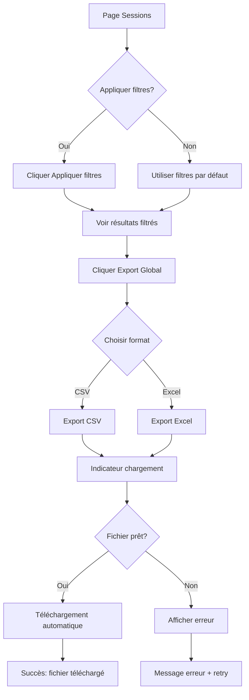
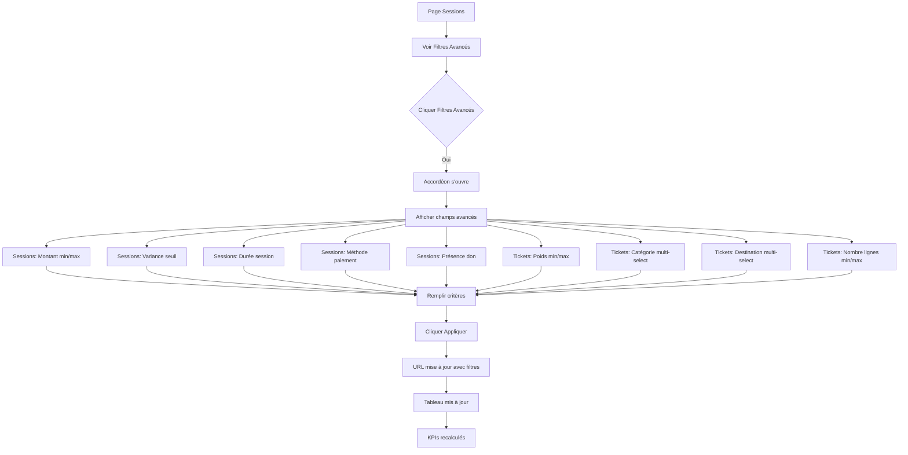
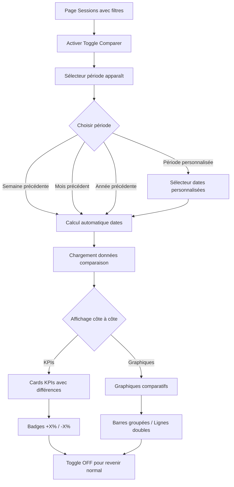
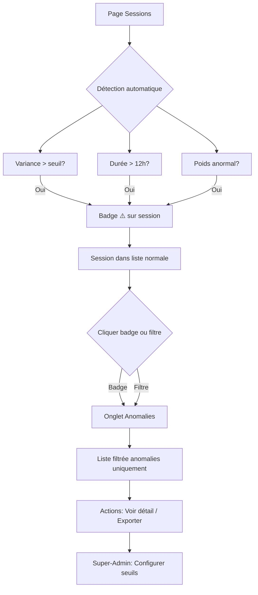
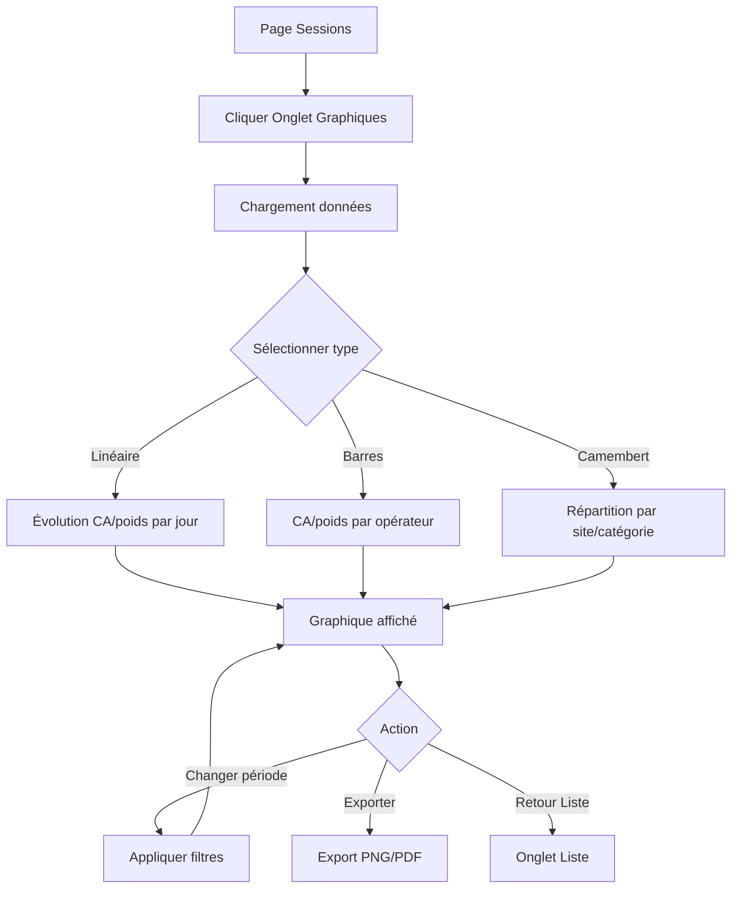
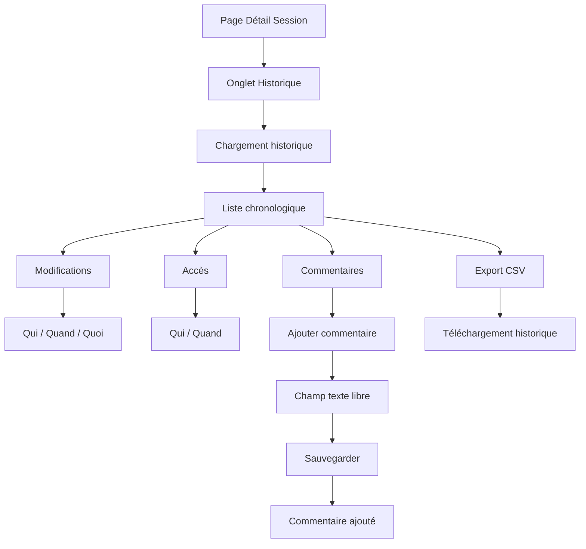
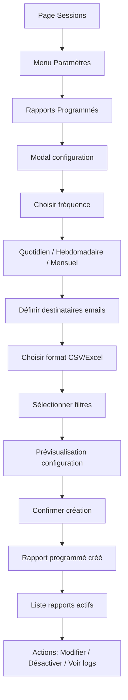
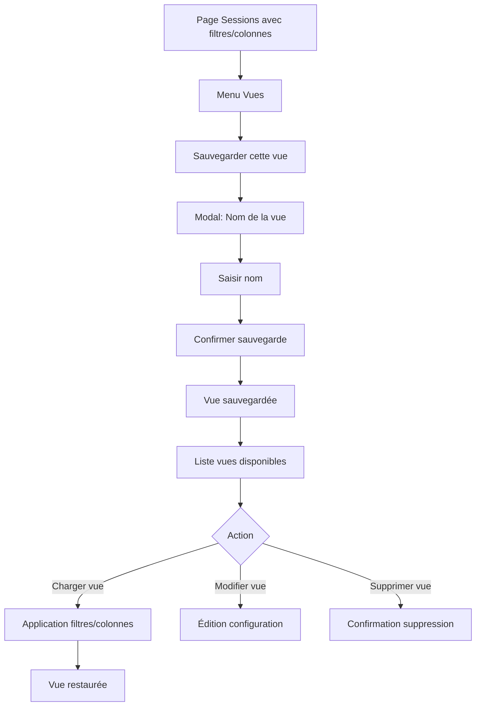

# Recyclic UI/UX Specification - Audit Sessions Avancé

This document defines the user experience goals, information architecture, user flows, and visual design specifications for Recyclic's advanced audit sessions interface. It serves as the foundation for visual design and frontend development, ensuring a cohesive and user-centered experience.

## Overall UX Goals & Principles

### Target User Personas

**Administrateur (admin)**
- Utilisateurs qui effectuent des audits réguliers des sessions de caisse et de réception
- Besoins : Export rapide de grandes quantités de données, filtres précis, détection d'anomalies, comparaisons périodes
- Fréquence d'utilisation : Quotidienne à hebdomadaire
- Niveau technique : Intermédiaire
- Accès : Toutes les fonctionnalités d'audit (Phase 1, 2, 3)

**Super-Administrateur (super-admin)**
- Utilisateurs experts qui configurent les paramètres avancés et la traçabilité
- Besoins : Accès à toutes les fonctionnalités, configuration fine, historique complet, rapports programmés
- Fréquence d'utilisation : Variable (selon besoins)
- Niveau technique : Avancé
- Accès : Toutes les fonctionnalités + configuration système (seuils anomalies, rapports programmés)

### Usability Goals

- **Efficacité d'utilisation** : Réduction de 90% du temps pour exporter 100 sessions (de 100 clics à 1 clic)
- **Apprentissage rapide** : Nouveaux utilisateurs peuvent effectuer un export de base en < 2 minutes
- **Découverte progressive** : Fonctionnalités avancées accessibles sans surcharger l'interface de base
- **Prévention d'erreurs** : Validation claire des filtres, confirmation pour exports volumineux
- **Mémorabilité** : Interface cohérente permettant aux utilisateurs occasionnels de retrouver rapidement les fonctionnalités

### Design Principles

1. **Simplicité par défaut, puissance à la demande** - Interface simple pour 80% des cas d'usage, fonctionnalités avancées accessibles mais discrètes
2. **Cohérence avec l'existant** - Respecter les patterns établis dans SessionManager.tsx et ReceptionSessionManager.tsx
3. **Découverte progressive** - Fonctionnalités Phase 2/3 masquées par défaut, révélées via mode expert ou activation progressive
4. **Feedback immédiat** - Chaque action (filtre, export, comparaison) doit avoir un retour visuel clair
5. **Performance perceptible** - Indicateurs de chargement pour exports longs, pagination efficace pour grandes quantités
6. **Accessibilité dès le départ** - Navigation clavier complète, support lecteurs d'écran, contrastes WCAG 2.1 AA

## Information Architecture (IA)

### Site Map / Screen Inventory

```mermaid
graph TD
    A[Admin Dashboard] --> B[Sessions de Caisse]
    A --> C[Sessions de Réception]
    
    B --> B1[Vue Liste - Phase 1]
    B --> B2[Vue Graphiques - Phase 2]
    B --> B3[Vue Anomalies - Phase 2]
    B --> B4[Détail Session]
    B4 --> B4a[Onglet Historique - Phase 3]
    
    C --> C1[Vue Liste - Phase 1]
    C --> C2[Vue Graphiques - Phase 2]
    C --> C3[Vue Anomalies - Phase 2]
    C --> C4[Détail Ticket]
    C4 --> C4a[Onglet Historique - Phase 3]
    
    B1 --> B1a[Filtres Base]
    B1 --> B1b[Filtres Avancés - Phase 1]
    B1 --> B1c[Export Global - Phase 1]
    B1 --> B1d[Export Excel - Phase 1]
    B1 --> B1e[Comparaison Périodes - Phase 2]
    B1 --> B1f[Vues Sauvegardées - Phase 3]
    B1 --> B1g[Rapports Programmés - Phase 3]
    
    C1 --> C1a[Filtres Base]
    C1 --> C1b[Filtres Avancés - Phase 1]
    C1 --> C1c[Export Global - Phase 1]
    C1 --> C1d[Export Excel - Phase 1]
    C1 --> C1e[Comparaison Périodes - Phase 2]
    C1 --> C1f[Vues Sauvegardées - Phase 3]
    C1 --> C1g[Rapports Programmés - Phase 3]
```

### Navigation Structure

**Primary Navigation:**
- Barre d'outils horizontale en haut de chaque page (Sessions de Caisse / Sessions de Réception)
- Boutons d'action principaux : Export Global, Comparer (Phase 2), Vues (Phase 3), Paramètres (Phase 3)
- Position : En haut à droite, après le titre de la page

**Secondary Navigation:**
- Onglets de vue : Liste | Graphiques | Anomalies (Phase 2)
- Position : Sous les KPIs, avant le tableau
- Par défaut : Onglet "Liste" actif

**Breadcrumb Strategy:**
- Pas de breadcrumb nécessaire (navigation plate depuis Admin Dashboard)
- Titre de page clair : "Sessions de Caisse" ou "Sessions de Réception"
- Retour via bouton "Retour" ou navigation latérale AdminLayout

## User Flows

### Flow 1: Export Global Multi-Sessions (Phase 1)

**User Goal:** Exporter toutes les sessions filtrées en un seul fichier CSV/Excel

**Entry Points:**
- Bouton "Exporter tout" dans la barre d'outils (Sessions de Caisse)
- Bouton "Exporter tout" dans la barre d'outils (Sessions de Réception)

**Success Criteria:**
- Fichier téléchargé contient toutes les sessions correspondant aux filtres actifs
- Format CSV ou Excel selon sélection utilisateur
- Temps d'export < 30 secondes pour 1000 sessions

**Flow Diagram:**

**Edge Cases & Error Handling:**
- Aucune session correspondant aux filtres : Message "Aucune session à exporter" + désactiver bouton
- Export trop volumineux (> 10 000 sessions) : Avertissement + confirmation utilisateur
- Erreur serveur : Message d'erreur clair + bouton "Réessayer"
- Export en cours : Désactiver bouton + spinner + message "Export en cours..."

**Notes:**
- Le bouton doit être visible même si aucun filtre n'est appliqué (export de toutes les sessions)
- Format Excel inclut mise en forme (en-têtes gras, couleurs, onglets Résumé + Détails)

---

### Flow 2: Filtres Avancés (Phase 1)

**User Goal:** Filtrer précisément les sessions avec critères multiples (montant, variance, durée, etc.)

**Entry Points:**
- Lien "Filtres Avancés ▼" sous les filtres de base
- Raccourci clavier (optionnel)

**Success Criteria:**
- Filtres avancés combinables avec filtres de base
- Résultats mis à jour immédiatement après application
- Filtres sauvegardés dans URL (partageable)

**Flow Diagram:**

**Edge Cases & Error Handling:**
- Montant min > montant max : Validation côté client + message d'erreur
- Filtres incompatibles : Message d'aide contextuelle
- Trop de filtres actifs : Afficher badge "X filtres actifs" + bouton "Réinitialiser"
- Filtres dans URL invalides : Nettoyer URL + appliquer filtres valides uniquement

**Notes:**
- Accordéon par défaut fermé pour ne pas surcharger l'interface
- Filtres de base toujours visibles (date, statut, opérateur, site, recherche)
- Sauvegarde URL permet partage de vues filtrées

---

### Flow 3: Comparaison Périodes (Phase 2)

**User Goal:** Comparer les KPIs d'une période avec une période de référence (semaine précédente, mois précédent, etc.)

**Entry Points:**
- Toggle "Comparer avec..." dans barre d'outils
- Menu déroulant pour sélectionner période de référence

**Success Criteria:**
- Affichage côte à côte des KPIs (période actuelle vs période de référence)
- Différences calculées et affichées (+X% ou -X%)
- Graphiques comparatifs disponibles

**Flow Diagram:**

**Edge Cases & Error Handling:**
- Période de référence sans données : Message "Aucune donnée pour cette période"
- Période de référence plus longue que période actuelle : Avertissement + normalisation optionnelle
- Calcul différences : Gérer division par zéro (afficher "N/A" ou "∞")
- Toggle désactivé : Retour immédiat à vue normale

**Notes:**
- Toggle visible uniquement en Phase 2+
- Par défaut désactivé pour ne pas surcharger
- Graphiques comparatifs dans onglet "Graphiques"

---

### Flow 4: Détection et Affichage Anomalies (Phase 2)

**User Goal:** Identifier rapidement les sessions/tickets nécessitant attention (variance élevée, durée anormale, etc.)

**Entry Points:**
- Onglet "Anomalies" (Phase 2)
- Badge "⚠️" sur sessions dans liste
- Filtre "Afficher uniquement les anomalies"

**Success Criteria:**
- Anomalies détectées automatiquement selon seuils configurables
- Badges visibles dans liste principale
- Onglet dédié avec liste filtrée des anomalies uniquement

**Flow Diagram:**

**Edge Cases & Error Handling:**
- Aucune anomalie détectée : Message "Aucune anomalie détectée" dans onglet
- Seuils non configurés : Utiliser valeurs par défaut (variance > 10€, durée > 12h)
- Anomalie corrigée : Badge disparaît après rechargement
- Performance : Détection côté serveur pour éviter calculs lourds côté client

**Notes:**
- Seuils configurables uniquement par Super-Admin (Phase 3)
- Badges colorés selon type d'anomalie (optionnel)
- Onglet Anomalies permet export spécifique

---

### Flow 5: Visualisations Graphiques (Phase 2)

**User Goal:** Visualiser les données sous forme de graphiques pour analyse rapide

**Entry Points:**
- Onglet "Graphiques" (Phase 2)
- Bouton "Voir graphiques" depuis vue Liste

**Success Criteria:**
- Graphiques chargés rapidement (< 2 secondes)
- Types de graphiques disponibles : linéaire, barres, camembert
- Export graphiques en PNG/PDF

**Flow Diagram:**

**Edge Cases & Error Handling:**
- Pas de données : Message "Aucune donnée à afficher" + graphique vide
- Trop de points : Agrégation automatique (par jour → par semaine)
- Erreur chargement : Message d'erreur + bouton "Réessayer"
- Export échoue : Message d'erreur + alternative (copier image)

**Notes:**
- Bibliothèque : `recharts` ou `chart.js` (à valider avec dev)
- Graphiques réactifs (responsive)
- Légendes claires et accessibles

---

### Flow 6: Traçabilité et Historique (Phase 3)

**User Goal:** Consulter l'historique complet des modifications et accès d'une session/ticket

**Entry Points:**
- Onglet "Historique" dans page de détail session/ticket
- Accessible uniquement pour Super-Admin

**Success Criteria:**
- Liste chronologique des modifications (qui, quand, quoi)
- Logs des accès (qui a consulté)
- Possibilité d'ajouter commentaires d'audit
- Export historique en CSV

**Flow Diagram:**

**Edge Cases & Error Handling:**
- Historique vide : Message "Aucun historique disponible"
- Erreur chargement : Message d'erreur + retry
- Commentaire trop long : Validation côté client (max 1000 caractères)
- Export échoue : Message d'erreur + alternative

**Notes:**
- Accessible uniquement Super-Admin (Phase 3)
- Historique en lecture seule sauf commentaires
- Format chronologique inversé (plus récent en haut)

---

### Flow 7: Rapports Programmés (Phase 3)

**User Goal:** Configurer des exports automatiques récurrents par email

**Entry Points:**
- Menu "⚙️ Paramètres" dans barre d'outils
- Option "Rapports programmés" dans menu

**Success Criteria:**
- Configuration complète (fréquence, destinataires, format, filtres)
- Confirmation de création
- Logs des envois consultables

**Flow Diagram:**

**Edge Cases & Error Handling:**
- Email invalide : Validation côté client + message d'erreur
- Aucun destinataire : Message d'avertissement
- Fréquence invalide : Validation + suggestions
- Erreur création job : Message d'erreur + retry
- Job échoue : Notification email + logs consultables

**Notes:**
- Accessible uniquement Super-Admin (Phase 3)
- Jobs en arrière-plan (cron)
- Logs des envois dans interface

---

### Flow 8: Vues Sauvegardées (Phase 3)

**User Goal:** Sauvegarder une configuration de filtres et colonnes pour réutilisation rapide

**Entry Points:**
- Menu déroulant "Vues" dans barre d'outils
- Option "Sauvegarder cette vue"

**Success Criteria:**
- Vue sauvegardée avec nom personnalisé
- Restauration rapide de la vue (1 clic)
- Partage possible (si permissions)

**Flow Diagram:**

**Edge Cases & Error Handling:**
- Nom déjà utilisé : Message d'erreur + suggérer nom alternatif
- Vue invalide (filtres obsolètes) : Message d'avertissement + option nettoyer
- Trop de vues : Limite (ex: 10 vues max par utilisateur)
- Erreur sauvegarde : Message d'erreur + retry

**Notes:**
- Vues sauvegardées par utilisateur (pas partagées par défaut)
- Export possible de la vue actuelle (tableau tel qu'affiché)
- Mode impression optimisé (optionnel)

## Wireframes & Mockups

### Design Files

**Primary Design Files:** À créer dans Figma (ou outil de design choisi)

**Référence existante:**
- Composant `SessionManager.tsx` : Structure actuelle avec KPIs, filtres, tableau
- Composant `ReceptionSessionManager.tsx` : Structure similaire pour tickets de réception
- Design system : styled-components avec patterns existants (Cards, FiltersBar, Table)

### Key Screen Layouts

#### Screen 1: Sessions de Caisse - Vue Liste (Phase 1)

**Purpose:** Interface principale pour audit des sessions de caisse avec export global et filtres avancés

**Key Elements:**
- Titre : "Sessions de Caisse"
- Barre d'outils (haut droite) : Bouton "Exporter tout" avec menu déroulant (CSV | Excel)
- KPIs Cards (5 cartes) : CA Total, Nb Ventes, Poids Total, Total Dons, Nb Sessions
- Filtres de base (toujours visibles) : Date début, Date fin, Statut, Opérateur, Site, Recherche
- Filtres avancés (accordéon fermé par défaut) : Montant min/max, Variance seuil, Durée, Méthode paiement, Présence don
- Tableau des sessions : Colonnes triables (Statut, Ouverture, Opérateur, Nb ventes, Total ventes, Total dons, Écart, Actions)
- Pagination en bas du tableau

**Interaction Notes:**
- Filtres avancés : Accordéon expandable sous filtres de base
- Export global : Menu déroulant sur bouton "Exporter tout" → CSV ou Excel
- Tri : Clic sur en-tête de colonne pour trier (asc/desc/null)
- Clic sur ligne : Navigation vers détail session

**Design File Reference:** `docs/ux/wireframes/sessions-caisse-phase1.png` (à créer)

---

#### Screen 2: Sessions de Caisse - Vue avec Onglets (Phase 2)

**Purpose:** Interface enrichie avec onglets pour graphiques et anomalies

**Key Elements:**
- Même structure que Phase 1
- Barre d'outils enrichie : "Exporter tout" | "Comparer" (toggle) | "Vues" (Phase 3) | "⚙️ Paramètres" (Phase 3)
- Onglets sous KPIs : "Liste" | "Graphiques" | "Anomalies"
- Toggle "Comparer avec..." : Sélecteur période (Semaine précédente, Mois précédent, etc.)
- Affichage côte à côte KPIs : Période actuelle vs Période de référence avec badges +X% / -X%

**Interaction Notes:**
- Onglet "Liste" : Vue tableau standard (par défaut)
- Onglet "Graphiques" : Graphiques (linéaire, barres, camembert) avec sélecteur de type
- Onglet "Anomalies" : Liste filtrée des sessions avec badge ⚠️ uniquement
- Toggle comparaison : Active/désactive affichage côte à côte des KPIs

**Design File Reference:** `docs/ux/wireframes/sessions-caisse-phase2.png` (à créer)

---

#### Screen 3: Sessions de Caisse - Vue Expert (Phase 3)

**Purpose:** Interface complète avec toutes les fonctionnalités avancées

**Key Elements:**
- Même structure que Phase 2
- Menu "⚙️ Paramètres" : Options "Rapports programmés", "Configurer seuils anomalies" (Super-Admin)
- Menu "Vues" : Liste vues sauvegardées + "Sauvegarder cette vue"
- Onglet "Historique" dans page de détail session (Super-Admin uniquement)

**Interaction Notes:**
- Rapports programmés : Modal de configuration (fréquence, destinataires, format, filtres)
- Vues sauvegardées : Menu déroulant avec liste + option sauvegarder
- Historique : Onglet dans détail session avec liste chronologique modifications/accès

**Design File Reference:** `docs/ux/wireframes/sessions-caisse-phase3.png` (à créer)

---

#### Screen 4: Sessions de Réception - Vue Liste (Phase 1)

**Purpose:** Interface principale pour audit des tickets de réception (structure identique à Sessions de Caisse)

**Key Elements:**
- Titre : "Sessions de Réception"
- Même structure que Sessions de Caisse Phase 1
- Filtres spécifiques : Bénévole au lieu d'Opérateur
- Filtres avancés spécifiques : Poids min/max, Catégorie (multi-select), Destination (multi-select), Nombre lignes min/max
- KPIs adaptés : Poids total, Nb tickets, Nb lignes, etc.
- Tableau des tickets : Colonnes adaptées (Statut, Date, Bénévole, Nb lignes, Poids total, Actions)

**Interaction Notes:**
- Même patterns d'interaction que Sessions de Caisse
- Export global : Même comportement (CSV/Excel)

**Design File Reference:** `docs/ux/wireframes/sessions-reception-phase1.png` (à créer)

---

#### Screen 5: Modal Filtres Avancés (Mobile/Tablette)

**Purpose:** Version responsive des filtres avancés en modal plein écran

**Key Elements:**
- Modal plein écran (mobile) ou modal centré (tablette)
- Tous les filtres avancés dans une seule vue scrollable
- Boutons : "Appliquer" (primaire) | "Réinitialiser" | "Fermer" (X)

**Interaction Notes:**
- Ouverture : Clic sur "Filtres Avancés" → Modal s'ouvre
- Fermeture : Clic sur "Appliquer" (ferme + applique) ou "X" (ferme sans appliquer)
- Scroll vertical pour accéder à tous les filtres

**Design File Reference:** `docs/ux/wireframes/modal-filtres-avances.png` (à créer)

---

#### Screen 6: Modal Rapports Programmés (Phase 3)

**Purpose:** Configuration des exports automatiques récurrents

**Key Elements:**
- Modal centré avec formulaire
- Champs : Fréquence (select), Destinataires (multi-input emails), Format (radio CSV/Excel), Filtres (prévisualisation)
- Boutons : "Créer rapport" (primaire) | "Annuler"
- Section "Rapports actifs" : Liste des rapports configurés avec actions (Modifier, Désactiver, Voir logs)

**Interaction Notes:**
- Validation en temps réel des emails
- Prévisualisation des filtres appliqués
- Confirmation après création

**Design File Reference:** `docs/ux/wireframes/modal-rapports-programmes.png` (à créer)

## Component Library / Design System

### Design System Approach

**Approche hybride :** Réutiliser les composants existants (styled-components + Mantine UI) et étendre avec de nouveaux composants spécifiques aux fonctionnalités d'audit avancé.

**Bibliothèques existantes :**
- **styled-components** : Composants de base (Container, Title, FiltersBar, Input, Select, Table, Card, Button)
- **Mantine UI** : Composants avancés (Button, Modal, Grid, Paper, Stack) - utilisé dans DashboardHomePage
- **lucide-react** : Icônes (Calendar, Users, Scale, Euro, Search, ChevronUp, ChevronDown, etc.)
- **@tabler/icons-react** : Icônes supplémentaires (IconCash, IconReport, IconActivity, etc.)

**Stratégie :**
- Réutiliser les patterns existants de `SessionManager.tsx` et `ReceptionSessionManager.tsx`
- Créer de nouveaux composants réutilisables pour les fonctionnalités Phase 2/3
- Maintenir la cohérence visuelle avec le design existant

### Core Components

#### Component: AdvancedFiltersAccordion

**Purpose:** Accordéon pour afficher/masquer les filtres avancés (Phase 1)

**Variants:**
- Par défaut : Fermé (masqué)
- Ouvert : Affiche tous les champs de filtres avancés

**States:**
- Closed (par défaut)
- Open (expanded)
- Loading (pendant application des filtres)

**Usage Guidelines:**
- Placé sous les filtres de base
- Bouton "Filtres Avancés ▼" pour ouvrir/fermer
- Animation de transition douce (0.2s)
- Sur mobile/tablette : Utiliser modal au lieu d'accordéon

---

#### Component: ExportButton

**Purpose:** Bouton d'export global avec menu déroulant pour choisir le format (CSV/Excel)

**Variants:**
- Primary : Bouton principal "Exporter tout"
- With dropdown : Menu déroulant avec options CSV | Excel

**States:**
- Default
- Loading (pendant export)
- Disabled (si aucune session à exporter)

**Usage Guidelines:**
- Position : Barre d'outils en haut à droite
- Icône : Download ou FileSpreadsheet (lucide-react)
- Menu déroulant : Apparaît au clic
- Indicateur de chargement : Spinner + texte "Export en cours..."

---

#### Component: ComparisonToggle

**Purpose:** Toggle pour activer/désactiver la comparaison de périodes (Phase 2)

**Variants:**
- Simple toggle : ON/OFF
- With selector : Toggle + sélecteur période (Semaine précédente, Mois précédent, etc.)

**States:**
- Off (par défaut)
- On (comparaison active)
- Loading (chargement données comparaison)

**Usage Guidelines:**
- Position : Barre d'outils, à côté du bouton Export
- Sélecteur période : Apparaît quand toggle activé
- Affichage côte à côte : KPIs avec badges +X% / -X%

---

#### Component: ViewTabs

**Purpose:** Onglets pour basculer entre Liste, Graphiques, Anomalies (Phase 2)

**Variants:**
- Horizontal tabs : Onglets horizontaux (desktop)
- Accordion tabs : Accordéon (mobile)

**States:**
- Active tab : Onglet sélectionné
- Inactive tabs : Onglets non sélectionnés
- Disabled : Onglet désactivé (si pas de données)

**Usage Guidelines:**
- Position : Sous les KPIs, avant le tableau
- Onglet par défaut : "Liste"
- Indicateur visuel : Bordure inférieure pour onglet actif
- Responsive : Transformer en accordéon sur mobile

---

#### Component: AnomalyBadge

**Purpose:** Badge d'avertissement pour sessions/tickets avec anomalies (Phase 2)

**Variants:**
- Warning : Badge ⚠️ jaune/orange
- Critical : Badge ⚠️ rouge (si anomalie critique)

**States:**
- Visible : Anomalie détectée
- Hidden : Aucune anomalie

**Usage Guidelines:**
- Position : À côté du statut dans le tableau
- Tooltip : Afficher type d'anomalie au survol
- Clic : Filtrer pour afficher uniquement les anomalies

---

#### Component: SavedViewsMenu

**Purpose:** Menu déroulant pour gérer les vues sauvegardées (Phase 3)

**Variants:**
- Dropdown menu : Menu déroulant avec liste des vues
- With actions : Actions (Charger, Modifier, Supprimer) pour chaque vue

**States:**
- Closed (par défaut)
- Open (menu déroulant affiché)
- Empty (aucune vue sauvegardée)

**Usage Guidelines:**
- Position : Barre d'outils, bouton "Vues"
- Option "Sauvegarder cette vue" : En bas du menu
- Liste des vues : Maximum 10 vues par utilisateur

---

#### Component: ScheduledReportsModal

**Purpose:** Modal pour configurer les rapports programmés (Phase 3)

**Variants:**
- Create : Création d'un nouveau rapport
- Edit : Modification d'un rapport existant

**States:**
- Closed (par défaut)
- Open (modal affichée)
- Loading (sauvegarde en cours)
- Error (erreur de validation)

**Usage Guidelines:**
- Accessible via : Menu "⚙️ Paramètres" → "Rapports programmés"
- Formulaire : Fréquence, destinataires, format, filtres
- Validation : Côté client avant soumission
- Confirmation : Message de succès après création

---

#### Component: HistoryTab

**Purpose:** Onglet pour afficher l'historique des modifications (Phase 3)

**Variants:**
- Timeline view : Vue chronologique (plus récent en haut)
- Table view : Vue tableau (optionnel)

**States:**
- Loading (chargement historique)
- Empty (aucun historique)
- With data (historique affiché)

**Usage Guidelines:**
- Position : Onglet dans page de détail session/ticket
- Accessible : Super-Admin uniquement
- Actions : Ajouter commentaire d'audit, Export CSV

---

#### Component: ChartContainer

**Purpose:** Conteneur pour les graphiques (Phase 2)

**Variants:**
- Line chart : Graphique linéaire (évolution dans le temps)
- Bar chart : Graphique en barres (comparaison catégories)
- Pie chart : Graphique camembert (répartition)

**States:**
- Loading (chargement données)
- Empty (aucune donnée)
- With data (graphique affiché)
- Error (erreur de chargement)

**Usage Guidelines:**
- Bibliothèque : `recharts` ou `chart.js` (à valider avec dev)
- Responsive : S'adapte à la largeur du conteneur
- Export : Bouton pour exporter en PNG/PDF
- Légendes : Accessibles et claires

---

#### Component: Toolbar

**Purpose:** Barre d'outils principale avec tous les boutons d'action

**Variants:**
- Full toolbar : Tous les boutons visibles (desktop)
- Compact toolbar : Icônes uniquement (tablette)
- Hamburger menu : Menu hamburger (mobile)

**States:**
- Default
- With active filters : Badge indiquant nombre de filtres actifs

**Usage Guidelines:**
- Position : En haut à droite, après le titre
- Boutons : Export Global, Comparer (Phase 2), Vues (Phase 3), Paramètres (Phase 3)
- Responsive : Adapter selon taille d'écran

## Branding & Style Guide

### Visual Identity

**Brand Guidelines:** Cohérence avec le design existant de Recyclic - interface administrative claire et fonctionnelle

**Approche:** Design minimaliste axé sur la lisibilité et l'efficacité, sans éléments décoratifs superflus

### Color Palette

| Color Type | Hex Code | Usage |
|------------|----------|-------|
| Primary | #111827 | Boutons principaux, texte important |
| Secondary | #6b7280 | Texte secondaire, labels |
| Accent | #1f2937 | Titres, texte principal |
| Success | #16a34a | Statut "ouvert", indicateurs positifs |
| Warning | #f57c00 | Avertissements, badges anomalies |
| Error | #ef4444 | Statut "fermé", erreurs, actions destructives |
| Neutral - Background | #ffffff | Fond principal (cartes, modals) |
| Neutral - Background Light | #f9fafb | Fond en-têtes tableaux |
| Neutral - Background Subtle | #f3f4f6 | Fond icônes, hover states |
| Neutral - Border | #e5e7eb | Bordures, séparateurs |
| Neutral - Text Primary | #111827 | Texte principal |
| Neutral - Text Secondary | #6b7280 | Texte secondaire, labels |
| Neutral - Text Muted | #4b5563 | Texte en-têtes tableaux |

**Couleurs supplémentaires identifiées :**
- Success alternatif : #4caf50, #45a049 (boutons succès)
- Error alternatif : #f44336, #d32f2f (boutons erreur)
- Warning background : #fff3e0 (fond badges avertissement)

### Typography

#### Font Families

- **Primary:** System fonts (sans-serif) - Utilisation des polices système pour performance
- **Secondary:** N/A (pas de police secondaire définie)
- **Monospace:** N/A (pas de police monospace utilisée actuellement)

#### Type Scale

| Element | Size | Weight | Line Height | Usage |
|---------|------|--------|-------------|-------|
| H1 | 1.8rem | 700 | 1.2 | Titres de page (Sessions de Caisse, Sessions de Réception) |
| H2 | N/A | N/A | N/A | Non utilisé actuellement |
| H3 | N/A | N/A | N/A | Non utilisé actuellement |
| Body | 0.95rem | 400 | 1.5 | Texte principal, contenu tableaux |
| Small | 0.8rem - 0.9rem | 400 | 1.4 | Labels, texte secondaire, en-têtes tableaux |
| Card Value | 1.2rem | 700 | 1.2 | Valeurs dans cartes KPI |
| Card Label | 0.8rem | 400 | 1.4 | Labels dans cartes KPI |

**Notes:**
- Pas de police personnalisée définie (utilisation des polices système)
- Tailles en rem pour respecter les préférences utilisateur
- Poids de police limités (400, 700) pour simplicité

### Iconography

**Icon Library:** 
- **lucide-react** : Icônes principales (Calendar, Users, Scale, Euro, Search, ChevronUp, ChevronDown, etc.)
- **@tabler/icons-react** : Icônes supplémentaires (IconCash, IconReport, IconActivity, IconSettings, etc.)

**Usage Guidelines:**
- Taille standard : 16px-20px pour icônes inline
- Taille grande : 32px-40px pour icônes dans cartes KPI
- Couleur : Hérite de la couleur du texte parent ou couleur spécifique selon contexte
- Espacement : 8px-12px de gap entre icône et texte
- Cohérence : Utiliser lucide-react en priorité, @tabler/icons-react pour cas spécifiques

### Spacing & Layout

**Grid System:**
- Pas de système de grille formel défini
- Utilisation de CSS Grid et Flexbox selon besoins
- Grid pour KPIs : `grid-template-columns: repeat(5, minmax(180px, 1fr))`
- Grid pour filtres : `grid-template-columns: repeat(4, minmax(180px, 1fr)) 1fr`

**Spacing Scale:**
- **Container padding:** 24px
- **Card padding:** 16px
- **Table cell padding:** 12px
- **Input padding:** 10px 12px
- **Button padding:** 8px 12px (standard), 10px 20px (large)
- **Gap entre éléments:** 8px, 12px, 16px, 20px
- **Margin sections:** 12px, 16px, 20px, 24px

**Border Radius:**
- **Petit:** 6px (boutons, badges)
- **Moyen:** 8px (inputs, boutons, cartes)
- **Grand:** 10px (tableaux, cartes principales)
- **Très grand:** 12px (boutons importants)
- **Rond:** 9999px (badges, status dots)

**Shadows:**
- **Subtile:** `0 1px 2px rgba(0,0,0,0.04)` (cartes)
- **Moyenne:** `0 2px 4px rgba(0,0,0,0.1)` (modals, conteneurs)
- **Élevée:** `0 4px 12px rgba(0,0,0,0.15)` (hover states)

## Accessibility Requirements

### Compliance Target

**Standard:** WCAG 2.1 Level AA (conformité minimale requise)

**Justification:** Interface administrative utilisée par des administrateurs et super-administrateurs, nécessitant un accès complet via clavier et lecteurs d'écran

### Key Requirements

**Visual:**
- **Color contrast ratios:** 
  - Texte normal : Ratio minimum 4.5:1 (ex: #111827 sur #ffffff = 15.8:1 ✓)
  - Texte large : Ratio minimum 3:1 (titres, valeurs KPI)
  - Éléments interactifs : Ratio minimum 3:1 pour bordures et indicateurs
- **Focus indicators:** 
  - Contour visible 2px minimum autour des éléments focusables
  - Couleur de focus distincte (ex: #111827 avec outline bleu)
  - Tous les éléments interactifs doivent avoir un état focus visible
- **Text sizing:** 
  - Texte redimensionnable jusqu'à 200% sans perte de fonctionnalité
  - Tailles minimales : 0.8rem (small) à 1.8rem (H1)
  - Pas de texte en images (utiliser du texte réel)

**Interaction:**
- **Keyboard navigation:** 
  - Tous les éléments interactifs accessibles au clavier (Tab, Enter, Espace, Flèches)
  - Ordre de tabulation logique (de haut en bas, gauche à droite)
  - Raccourcis clavier pour actions fréquentes (optionnel mais recommandé)
  - Pas de pièges au clavier (tous les éléments peuvent être quittés)
- **Screen reader support:** 
  - Attributs ARIA appropriés (aria-label, aria-describedby, aria-expanded, etc.)
  - Rôles ARIA corrects (button, tab, dialog, etc.)
  - États annoncés (ouvert/fermé, sélectionné/non sélectionné)
  - Textes alternatifs pour icônes (via aria-label ou texte visible)
- **Touch targets:** 
  - Taille minimale 44x44px pour éléments tactiles (boutons, liens)
  - Espacement minimum 8px entre éléments tactiles
  - Zones de clic généreuses pour éviter les erreurs

**Content:**
- **Alternative text:** 
  - Icônes décoratives : aria-hidden="true" ou alt=""
  - Icônes fonctionnelles : aria-label descriptif (ex: "Exporter toutes les sessions")
  - Graphiques : Descriptions textuelles ou tableaux de données équivalents
- **Heading structure:** 
  - Hiérarchie logique (H1 → H2 → H3)
  - Un seul H1 par page
  - Pas de saut de niveau (H1 suivi de H3 sans H2)
- **Form labels:** 
  - Labels explicites pour tous les champs de formulaire
  - Association label/input via htmlFor/id ou aria-labelledby
  - Messages d'erreur associés aux champs (aria-describedby)
  - Indicateurs de champs obligatoires (aria-required, astérisque visible)

### Testing Strategy

**Outils de test:**
- **WAVE** (Web Accessibility Evaluation Tool) : Extension navigateur pour audit rapide
- **axe DevTools** : Extension Chrome/Firefox pour tests automatisés
- **NVDA / JAWS** : Lecteurs d'écran pour tests manuels
- **Navigation clavier** : Tests manuels complets (Tab, Enter, Espace, Flèches)

**Tests à effectuer:**
1. **Navigation clavier complète** : Tous les éléments accessibles et utilisables
2. **Lecteur d'écran** : Tous les éléments annoncés correctement
3. **Contraste des couleurs** : Vérification avec outil (WAVE, axe)
4. **Zoom 200%** : Interface fonctionnelle et lisible
5. **Focus visible** : Tous les éléments focusables ont un indicateur visible
6. **Formulaires** : Labels associés, erreurs annoncées
7. **Tableaux** : En-têtes associés (scope="col"), résumés si nécessaire

**Responsabilité:**
- **Développement** : Implémentation des attributs ARIA, navigation clavier
- **QA** : Tests d'accessibilité avant chaque release
- **Review** : Validation avec outils automatisés + tests manuels

## Responsiveness Strategy

### Breakpoints

| Breakpoint | Min Width | Max Width | Target Devices |
|------------|-----------|-----------|----------------|
| Mobile | 0px | 767px | Smartphones (portrait et paysage) |
| Tablette | 768px | 1023px | Tablettes (iPad, Android tablets) |
| Desktop | 1024px | 1439px | Ordinateurs portables et écrans standards |
| Wide | 1440px | - | Grands écrans (moniteurs larges) |

**Approche:** Mobile-first (design pour mobile en premier, puis adaptation pour écrans plus grands)

### Adaptation Patterns

**Layout Changes:**
- **Desktop (> 1024px):**
  - Layout complet avec toutes les zones visibles
  - KPIs en grille 5 colonnes
  - Filtres en 2 rangées (4 colonnes + recherche)
  - Tableau complet avec toutes les colonnes
  - Barre d'outils horizontale complète
  - Onglets visibles côte à côte

- **Tablette (768px - 1024px):**
  - KPIs en grille 3 colonnes (réorganisation)
  - Filtres en modal au lieu d'accordéon
  - Tableau avec colonnes principales (masquer colonnes secondaires)
  - Barre d'outils compacte (icônes uniquement)
  - Onglets toujours accessibles mais plus compacts

- **Mobile (< 768px):**
  - KPIs en grille 2 colonnes ou liste verticale
  - Filtres en modal plein écran
  - Tableau scrollable horizontalement (avec indicateur visuel)
  - Barre d'outils en menu hamburger
  - Onglets en accordéon ou menu déroulant

**Navigation Changes:**
- **Desktop:** Navigation horizontale complète, tous les éléments visibles
- **Tablette:** Navigation compacte, éléments secondaires dans menu
- **Mobile:** Menu hamburger pour barre d'outils, navigation verticale

**Content Priority:**
- **Desktop:** Tous les contenus visibles simultanément
- **Tablette:** Contenu principal prioritaire, contenu secondaire accessible via interactions
- **Mobile:** Contenu essentiel uniquement, reste accessible via navigation

**Interaction Changes:**
- **Desktop:** Hover states, tooltips, interactions riches
- **Tablette:** Touch-friendly (zones de clic 44x44px minimum)
- **Mobile:** Gestures simplifiés, pas de hover, focus sur tap

**Spécificités par composant:**
- **Filtres avancés:** Accordéon (desktop) → Modal (tablette/mobile)
- **Tableau:** Colonnes complètes (desktop) → Colonnes principales + scroll horizontal (mobile)
- **KPIs:** Grille 5 colonnes (desktop) → Grille 2 colonnes (mobile)
- **Barre d'outils:** Boutons texte (desktop) → Icônes (tablette) → Menu hamburger (mobile)
- **Onglets:** Tabs horizontales (desktop) → Accordéon (mobile)

## Animation & Micro-interactions

### Motion Principles

**Approche:** Animations subtiles et fonctionnelles, jamais décoratives. Priorité à la performance et à l'accessibilité.

**Principes:**
1. **Feedback immédiat** : Chaque action utilisateur doit avoir un retour visuel instantané (< 100ms)
2. **Transitions douces** : Durées courtes (150-300ms) pour ne pas ralentir l'utilisateur
3. **Performance avant tout** : Utiliser `transform` et `opacity` pour animations GPU-accelerated
4. **Respect des préférences** : Respecter `prefers-reduced-motion` pour accessibilité
5. **Cohérence** : Mêmes durées et courbes d'easing pour interactions similaires

### Key Animations

- **Accordéon Filtres Avancés:** 
  - **Description:** Ouverture/fermeture de l'accordéon avec transition de hauteur
  - **Duration:** 200ms
  - **Easing:** ease-in-out
  - **Trigger:** Clic sur "Filtres Avancés ▼"

- **Bouton Export Loading:**
  - **Description:** Spinner rotatif pendant export + texte "Export en cours..."
  - **Duration:** Continu (jusqu'à fin export)
  - **Easing:** linear
  - **Trigger:** Clic sur "Exporter tout"

- **Toggle Comparaison:**
  - **Description:** Toggle switch avec transition + apparition sélecteur période
  - **Duration:** 200ms (toggle), 300ms (sélecteur)
  - **Easing:** ease-in-out
  - **Trigger:** Activation/désactivation toggle

- **Onglets Navigation:**
  - **Description:** Indicateur actif (bordure inférieure) avec transition
  - **Duration:** 200ms
  - **Easing:** ease-in-out
  - **Trigger:** Changement d'onglet

- **Badge Anomalie:**
  - **Description:** Badge ⚠️ avec pulse subtil (optionnel, si anomalie critique)
  - **Duration:** 2s (loop)
  - **Easing:** ease-in-out
  - **Trigger:** Affichage badge anomalie critique

- **Modal Ouverture/Fermeture:**
  - **Description:** Fade in/out + scale léger pour modals
  - **Duration:** 200ms
  - **Easing:** ease-out (ouverture), ease-in (fermeture)
  - **Trigger:** Ouverture/fermeture modal

- **Hover Boutons:**
  - **Description:** Légère élévation (translateY -2px) + ombre plus prononcée
  - **Duration:** 150ms
  - **Easing:** ease-out
  - **Trigger:** Hover sur boutons

- **Tableau Tri:**
  - **Description:** Changement d'icône de tri (ChevronUp/Down) avec transition
  - **Duration:** 150ms
  - **Easing:** ease-in-out
  - **Trigger:** Clic sur en-tête colonne triable

- **Chargement Données:**
  - **Description:** Skeleton loader ou spinner pour chargement tableaux/KPIs
  - **Duration:** Continu (jusqu'à chargement)
  - **Easing:** linear
  - **Trigger:** Chargement initial ou refresh données

- **Message Erreur/Succès:**
  - **Description:** Slide-in depuis le haut + fade in pour notifications
  - **Duration:** 300ms (entrée), 200ms (sortie)
  - **Easing:** ease-out (entrée), ease-in (sortie)
  - **Trigger:** Affichage message erreur/succès

**Notes d'implémentation:**
- Utiliser CSS transitions plutôt que JavaScript animations quand possible
- Respecter `@media (prefers-reduced-motion: reduce)` : désactiver animations non essentielles
- Tester performance sur appareils bas de gamme
- Éviter animations sur éléments qui bougent beaucoup (scroll, resize)

## Performance Considerations

### Performance Goals

- **Page Load:** 
  - Temps de chargement initial < 2 secondes (First Contentful Paint)
  - Temps de chargement complet < 3 secondes (Time to Interactive)
  - Métrique cible : Lighthouse Performance Score > 80

- **Interaction Response:** 
  - Réponse immédiate aux interactions utilisateur (< 100ms pour feedback visuel)
  - Filtres appliqués : Résultats affichés < 500ms
  - Tri de tableau : Réorganisation < 200ms
  - Changement d'onglet : Transition < 150ms

- **Animation FPS:** 
  - Animations fluides à 60 FPS sur appareils standards
  - Pas de jank ou de lag perceptible
  - Fallback gracieux sur appareils bas de gamme (réduire animations si nécessaire)

- **Export Performance:**
  - Export CSV : < 5 secondes pour 1000 sessions
  - Export Excel : < 30 secondes pour 1000 sessions (objectif epic B45)
  - Indicateur de progression pour exports longs (> 3 secondes)

### Design Strategies

**Optimisations côté interface:**
- **Lazy loading:** Charger les données par pages (pagination serveur)
- **Virtual scrolling:** Pour tableaux avec beaucoup de lignes (optionnel, si > 1000 lignes)
- **Debounce:** Recherche et filtres avec debounce 300ms pour éviter requêtes excessives
- **Memoization:** Mémoriser les résultats de filtres/tri pour éviter recalculs
- **Skeleton loaders:** Afficher structure pendant chargement (meilleure perception de performance)
- **Optimistic UI:** Mettre à jour interface immédiatement, rollback si erreur

**Gestion des données volumineuses:**
- **Pagination:** 20-50 éléments par page (configurable)
- **Filtres serveur:** Tous les filtres appliqués côté serveur (pas de filtrage client)
- **KPIs calculés serveur:** KPIs pré-calculés, pas de calcul côté client
- **Cache:** Mettre en cache les résultats de filtres fréquents (optionnel)

**Optimisations graphiques:**
- **Graphiques:** Lazy loading des graphiques (charger uniquement si onglet actif)
- **Bibliothèque légère:** Choisir bibliothèque graphiques performante (recharts recommandé)
- **Données agrégées:** Utiliser données agrégées pour graphiques (pas de calcul côté client)

**Responsive performance:**
- **Images/icons:** Utiliser SVG pour icônes (lucide-react déjà utilisé)
- **CSS:** Minimiser reflows/repaints avec `transform` et `opacity`
- **Mobile:** Réduire animations sur mobile si performance insuffisante

**Indicateurs de performance:**
- **Loading states:** Toujours afficher état de chargement (spinner, skeleton, progress bar)
- **Progression exports:** Barre de progression pour exports longs
- **Messages d'attente:** Messages informatifs ("Chargement des données...", "Export en cours...")

**Stratégies de fallback:**
- **Erreurs réseau:** Messages clairs + possibilité de retry
- **Timeout:** Gestion des timeouts avec messages explicites
- **Performance dégradée:** Désactiver animations si FPS < 30

## Next Steps

### Immediate Actions

1. **Review avec stakeholders** : Présenter ce document au Product Owner, Tech Lead et UX Designer (si disponible) pour validation
2. **Validation architecture** : Confirmer que l'architecture d'interface proposée répond aux besoins de toutes les stories B45-P1 à P9
3. **Décisions techniques** : Valider choix de bibliothèque graphiques (recharts vs chart.js) avec l'équipe dev
4. **Priorisation phases** : Confirmer l'ordre d'implémentation (Phase 1 → Phase 2 → Phase 3)
5. **Création wireframes détaillés** : Si nécessaire, créer des wireframes plus détaillés pour les écrans clés (optionnel selon besoins équipe)

### Design Handoff Checklist

- [x] **User flows documentés** : 8 flows principaux couvrant toutes les phases
- [x] **Information architecture définie** : Sitemap et structure de navigation complète
- [x] **Composants identifiés** : 10 composants principaux avec variants et states
- [x] **Style guide établi** : Couleurs, typographie, espacements documentés
- [x] **Accessibilité définie** : Exigences WCAG 2.1 AA documentées
- [x] **Responsive strategy** : Breakpoints et patterns d'adaptation définis
- [x] **Animations spécifiées** : 10 animations clés avec durées et easing
- [x] **Performance goals** : Objectifs et stratégies d'optimisation documentés
- [ ] **Wireframes détaillés** : À créer si nécessaire (optionnel)
- [ ] **Prototypes interactifs** : À créer si nécessaire (optionnel)
- [ ] **Validation stakeholders** : Review et approbation PO + Tech Lead + UX

### Questions Ouvertes / Décisions Nécessaires

1. **Bibliothèque graphiques** : Choisir entre `recharts` et `chart.js` (à valider avec dev)
2. **Wireframes détaillés** : Nécessité de créer des wireframes plus détaillés ou le document actuel suffit ?
3. **Mode expert** : Confirmer l'implémentation du toggle "mode expert" pour révéler toutes les fonctionnalités
4. **Onboarding** : Définir si tooltips/onboarding sont nécessaires pour nouvelles fonctionnalités
5. **Partage vues sauvegardées** : Déterminer si les vues sauvegardées peuvent être partagées entre utilisateurs

### Prochaines Étapes pour l'Équipe Dev

1. **Review technique** : L'équipe dev doit valider la faisabilité technique de l'architecture proposée
2. **Estimation** : Estimer l'effort pour chaque composant et fonctionnalité
3. **Planification** : Intégrer les stories B45-P1 à P9 dans le backlog avec cette spécification comme référence
4. **Implémentation Phase 1** : Commencer par les fondations (export global, filtres avancés, Excel)
5. **Tests utilisateurs** : Prévoir des tests utilisateurs avec admins pour valider l'UX avant Phase 2

### Références

- **Story source** : `docs/stories/story-b45-p0-design-ux-audit-avance.md`
- **Epic** : `docs/epics/epic-b45-audit-sessions-avance.md`
- **Composants existants** : 
  - `frontend/src/pages/Admin/SessionManager.tsx`
  - `frontend/src/pages/Admin/ReceptionSessionManager.tsx`
- **Design system** : styled-components + Mantine UI (patterns existants)

## Change Log

| Date | Version | Description | Author |
|------|---------|-------------|--------|
| 2025-01-27 | 1.0 | Document initial créé | Sally (UX Expert) |

